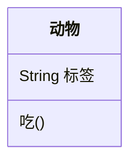
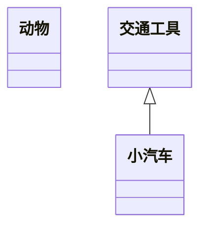

```mermaid
classDiagram
    class 动物
    动物 : String 标签
    动物 : 吃()
```

```mermaid
美人鱼
```

```java
private int func1(){
    
}
```


#### 定义表格

|学号|姓名|
|----|----|
|1|张三|
|2|李四|
|3|王五|



```mermaid
classDiagram
    class 动物
    交通工具 <|-- 小汽车
```
